# Typography

## The Montserrat Font

The old posters and signs in the traditional Montserrat neighborhood of Buenos
Aires inspired Julieta Ulanovsky to design this typeface and rescue the beauty
of urban typography that emerged in the first half of the twentieth century. As
urban development changes that place, it will never return to its original form
and loses forever the designs that are so special and unique. The letters that
inspired this project have work, dedication, care, color, contrast, light and
life, day and night! These are the types that make the city look so beautiful.
The Montserrat Project began with the idea to rescue what is in Montserrat and
set it free under a libre license, the SIL Open Font License.

This is the normal family, and it has two sister families so far,
[Alternates][1] and [Subrayada][2]. Many of the letterforms are special in the
Alternates family, while 'Subrayada' means 'Underlined' in Spanish and
celebrates a special style of underline that is integrated into the letterforms
found in the Montserrat neighborhood.

[1]: https://fonts.google.com/specimen/Montserrat+Alternates
[2]: https://fonts.google.com/specimen/Montserrat+Subrayada

Updated November 2017: The family was redrawn by Jacques Le Bailly at Baron von
Fonthausen over the summer, and the full set of weights were adjusted to make
the Regular lighter and better for use in longer texts. In fall, Julieta
Ulanovsky, Sol Matas, and Juan Pablo del Peral, led the development of Cyrillic
support, with consultation with Carolina Giovagnoli, Maria Doreuli, and Alexei
Vanyashin.

## Designers

The Montserrat project is led by Julieta Ulanovsky, a type designer based in
Buenos Aires, Argentina. To contribute, see
[github.com/JulietaUla/Montserrat][3].

[3]: https://github.com/JulietaUla/Montserrat

## License
These fonts are licensed under the [Open Font License][4].

[4]: https://scripts.sil.org/cms/scripts/page.php?site_id=nrsi&id=OFL

You can use them freely in your products & projects - print or digital,
commercial or otherwise. However, you can't sell the fonts on their own.

This isn't legal advice, please consider consulting a lawyer and see the full
license for all details.

# Font Style Montserrat

**Notice:** The font can be downloaded from the [Google Font Library][5].

[5]: https://fonts.google.com/specimen/Montserrat?selection.family=Montserrat&sidebar.open=true

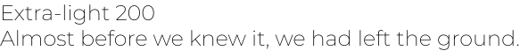
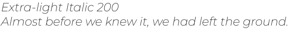

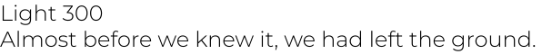
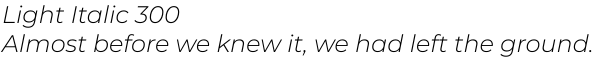

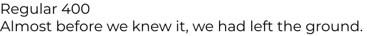
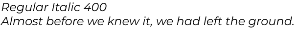

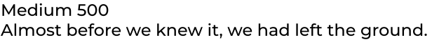
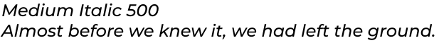

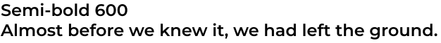
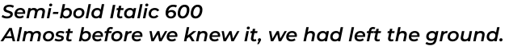

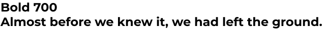
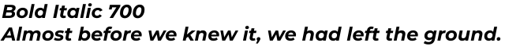

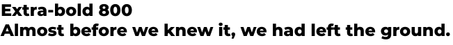
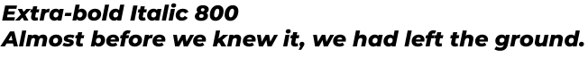

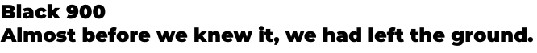
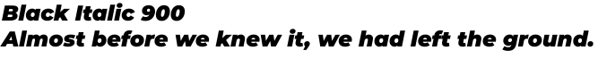

